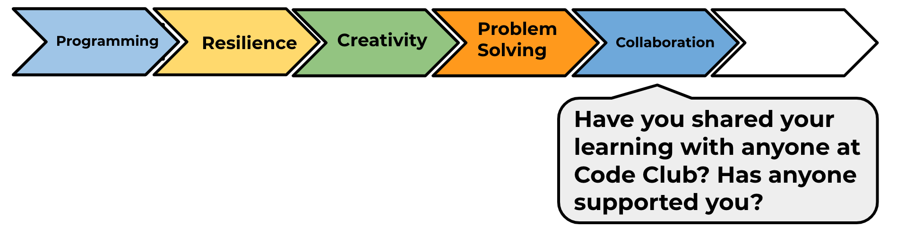

## What next?

Have a go at our 'Create your own world' project, where you’ll create your own adventure game!

You will find this project in the module pathway.

--- no-print ---

Click the green flag to start. Use the arrow keys to move your character around in the world.

  <iframe allowtransparency="true" width="485" height="402" src="https://scratch.mit.edu/projects/embed/258757783/?autostart=false" frameborder="0" scrolling="no"></iframe>
  

--- /no-print ---

--- print-only ---

You'll use the arrow keys to move your character around in the world.

--- /print-only ---

